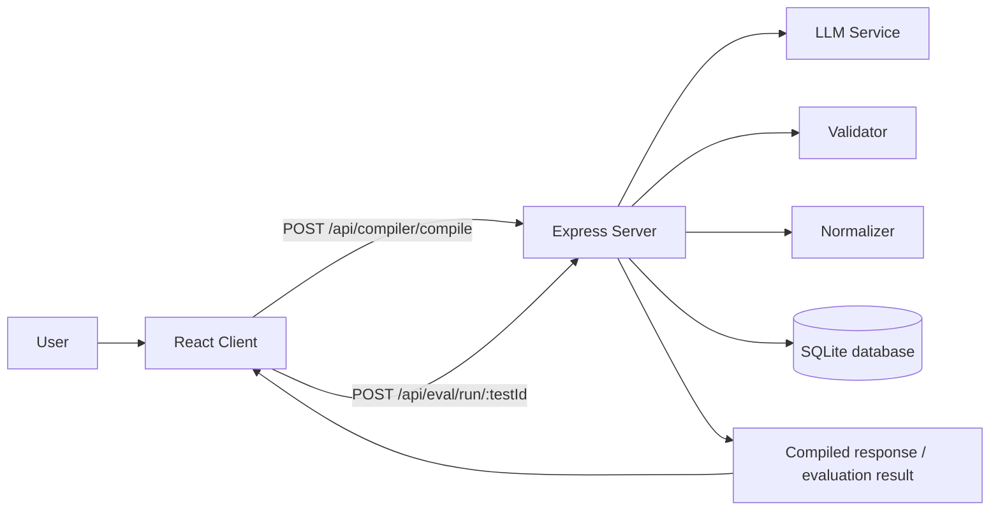
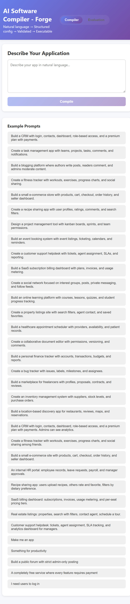
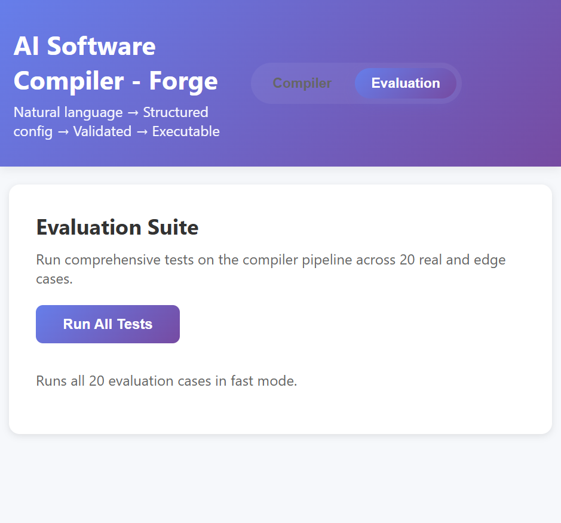

# AI Software Compiler - Forge

Forge is a full-stack AI-assisted application compiler. A user describes an app in natural language, the backend turns that prompt into a structured product spec, validates and repairs the result, and the React frontend presents the output and evaluation tools.

## Purpose

The goal of this project is to convert a plain-English product idea into a usable application blueprint. The system is designed to:

- extract intent from a prompt
- generate system design and schema information
- validate and auto-repair generated configs
- store compilation and evaluation history in SQLite
- provide a browser UI for compiling and running evaluation cases

## Architecture

The application is split into a Node/Express backend and a React client.



### Backend

The backend entry point is [server.js](server.js). It:

- starts the Express server
- initializes the SQLite database
- exposes compiler and evaluation routes
- serves the built React frontend from `client/build` when it exists

Backend route responsibilities:

- [routes/compiler.js](routes/compiler.js) handles prompt compilation, validation, repair, persistence, and result retrieval
- [routes/eval.js](routes/eval.js) runs the evaluation suite across a fixed set of test prompts

Core backend services and utilities:

- [services/llmService.js](services/llmService.js) resolves provider access and runs stage-based LLM calls
- [utils/validator.js](utils/validator.js) checks generated configs and performs small automatic repairs
- [utils/normalizeConfig.js](utils/normalizeConfig.js) reshapes generated output into a stable structure
- [utils/db.js](utils/db.js) stores compilation records and evaluation results in `database.db`

### Frontend

The client lives in [client/src](client/src). It is a standard React app that talks to the backend through Axios.

- [client/src/index.js](client/src/index.js) bootstraps the app and configures the API base URL
- [client/src/App.js](client/src/App.js) controls the main tab layout and compilation flow
- [client/src/components/CompilerForm.js](client/src/components/CompilerForm.js) collects the prompt and example inputs
- [client/src/components/ResultsView.js](client/src/components/ResultsView.js) renders the compilation output
- [client/src/components/EvalRunner.js](client/src/components/EvalRunner.js) runs the evaluation suite UI

### Data Flow

1. The user enters a prompt in the React frontend.
2. The frontend sends the prompt to `POST /api/compiler/compile`.
3. The backend runs staged LLM generation, normalization, validation, and optional repair.
4. The final config and metrics are stored in SQLite.
5. The compiled result is returned to the frontend for display.
6. The evaluation tab runs predefined prompt cases through the same pipeline and stores the results.

## Project Structure

```text
AI_Platform/
├─ server.js
├─ routes/
│  ├─ compiler.js
│  └─ eval.js
├─ services/
│  └─ llmService.js
├─ utils/
│  ├─ db.js
│  ├─ normalizeConfig.js
│  └─ validator.js
└─ client/
   ├─ public/
   └─ src/
      ├─ App.js
      ├─ App.css
      └─ components/
```

## Output Screenshots

### Compiler Home



### Evaluation Suite



## Local Run

Backend:

```bash
npm start
```

Frontend development server:

```bash
cd client
npm start
```

Production-style local preview:

```bash
cd client
npm run build
cd ..
npm start
```

The backend serves the compiled frontend automatically when `client/build` exists.

## Vercel Deployment

This repository is configured for Vercel with static frontend hosting plus serverless API routes under `api/`.

Set these environment variables in your Vercel project:

- `GROQ_API_KEY`
- `GROQ_MODEL` if you want to override the default `llama-3.1-8b-instant`
- `GROQ_MAX_TOKENS` if you want to tune response size

Deploy from the repository root. The frontend is served from `client/build`, and `/api/compiler/compile` plus `/api/eval/run-all` are handled by Vercel functions.